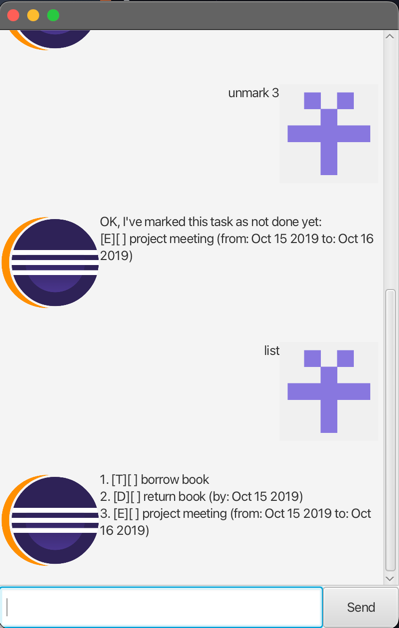

# Eclipse User Guide



Eclipse is a desktop application for storing tasks.
It provides a CLI for you to manage your todos, deadlines and events.

# Features

## Adding todos

Add a simple todo task with no dates related to it

Example: `todo read book`

```
Got it. I've added this task:
  [T][ ] read book
Now you have 4 tasks in the list.
```

## Adding deadlines

Add a deadline task with one due date

Example: `deadline return book /by 2019-10-15`

```
Got it. I've added this task:
  [D][ ] return book (by: Oct 15 2019)
Now you have 2 tasks in the list.
```

## Adding events

Add an event task with a start and an end date

Example: `event project meeting /from 2019-10-15 /to 2019-10-16`

```
Got it. I've added this task:
  [E][ ] project meeting (from: Oct 15 2019 to: Oct 16 2019)
Now you have 3 tasks in the list.
```

## Marking tasks

Mark the task at the given index as done

Example: `mark 3`

```
Nice! I've marked this task as done:
[E][X] project meeting (from: Oct 15 2019 to: Oct 16 2019)
```

## Unmarking tasks

Unmark the task at the given index

Example: `unmark 3`

```
OK, I've marked this task as not done yet:
[E][ ] project meeting (from: Oct 15 2019 to: Oct 16 2019)
```

## Listing tasks

List all the tasks stored

Example: `list`

```
Here are the tasks in your list:
1. [T][ ] borrow book
2. [D][ ] return book (by: Oct 15 2019)
3. [E][ ] project meeting (from: Oct 15 2019 to: Oct 16 2019)
```

## Finding tasks

Find the task containing a certain substring

Example: `find project meeting`

```
Here are the matching tasks in your list:
3. [E][ ] project meeting (from: Oct 15 2019 to: Oct 16 2019)
```

## Deleting tasks

Delete the task at the given index

Example: `delete 3`

```
Noted. I've removed this task:
  [E][ ] project meeting (from: Oct 15 2019 to: Oct 16 2019)
Now you have 2 tasks in the list.
```

## Getting stats

Retrieving the statistics related to the tasks

Example: `stats`

```
There are 2 tasks in total 
```
